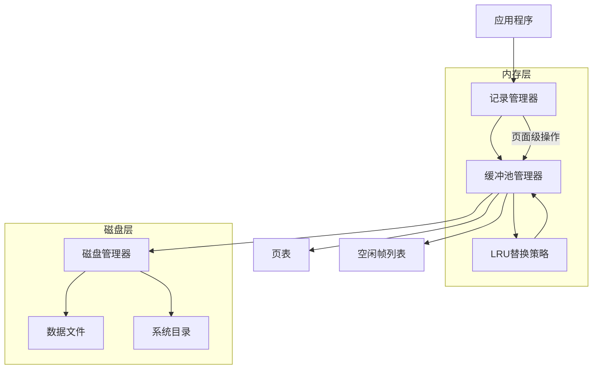
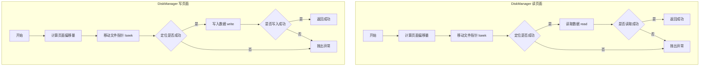
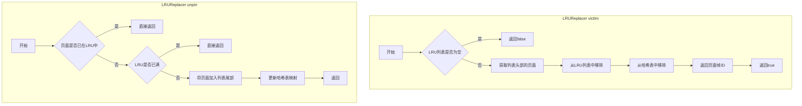

# Rucbase数据库存储管理系统实验报告

**22331091 陈超然**

## 1. 功能概述

本次实验基于Rucbase数据库原型系统框架，实现了数据库存储管理的核心功能，包括缓冲区管理和磁盘存储管理。主要完成了以下两个大任务：

**任务一：缓冲池管理器**

- 任务1.1：磁盘存储管理器（DiskManager）
- 任务1.2：缓冲池替换策略（LRUReplacer）  
- 任务1.3：缓冲池管理器（BufferPoolManager）

**任务二：记录管理器**

- 任务2.1：记录操作
- 任务2.2：记录迭代器

整个系统实现了完整的数据库存储管理功能，包括页面的读写、缓冲池的管理、LRU替换策略以及记录的增删改查操作。

## 2. 实验环境配置

### 2.1 开发环境

**操作系统**: Ubuntu 22.04.5 LTS (运行在开发容器中)

**编译器**: 
- C++ 编译器: g++ (支持C++17标准)
- 版本要求: 支持现代C++特性，包括智能指针、线程库等

**构建工具**:
- CMake: 用于项目构建和依赖管理
- Make: 执行具体的编译和链接任务

**开发工具**:
- Visual Studio Code: 主要开发IDE
- 开发容器支持: 提供一致的开发环境

### 2.2 项目结构

项目采用模块化设计，主要目录结构如下：

```
rucbase-lab/
├── CMakeLists.txt          # 主构建配置文件
├── src/                    # 源代码目录
│   ├── storage/           # 存储管理模块
│   ├── record/            # 记录管理模块  
│   ├── replacer/          # 页面替换策略
│   └── ...
├── build/                 # 构建输出目录
│   ├── bin/              # 可执行文件
│   └── lib/              # 静态库文件
├── test/                  # 测试代码
├── docs/                  # 实验文档
└── deps/                  # 第三方依赖
```

### 2.3 依赖库

**核心依赖**:
- **pthread**: 多线程支持，用于并发控制和锁机制
- **Google Test**: 单元测试框架，用于功能验证
- **标准C++库**: STL容器、智能指针、并发库等

**系统依赖**:
- Linux系统调用: 文件I/O操作 (read, write, lseek)
- POSIX线程库: 多线程和同步原语

### 2.4 编译配置

**编译选项**:
- 启用C++17标准
- 开启编译器优化
- 启用调试信息
- 线程安全编译

**构建命令**:
```bash
mkdir build
cd build
cmake ..
make -j$(nproc)
```

### 2.5 测试环境

**测试框架**: Google Test (gtest)

**测试覆盖范围**:
- 单元测试: 各个模块的功能验证
- 集成测试: 模块间协作测试  
- 并发测试: 多线程场景验证
- 性能测试: 关键操作的性能评估

**运行测试**:
```bash
cd build
make test
# 或者运行具体的测试
./bin/disk_manager_test
./bin/lru_replacer_test
./bin/buffer_pool_manager_test
./bin/record_manager_test
```

### 2.6 开发环境截图

以下是实验开发环境的配置和运行截图：

**开发环境界面**:
 
<!-- 请在此处添加VS Code开发环境的截图 -->

**项目构建过程**:

<!-- 请在此处添加cmake构建和编译过程的截图 -->

**测试运行结果**:

<!-- 请在此处添加测试执行和结果的截图 -->

## 3. 各功能模块的设计原理与实现方法

### 3.1 系统整体框架



### 3.2 磁盘存储管理器（DiskManager）

磁盘存储管理器负责与磁盘文件进行直接交互，提供页面级别的读写操作。

#### 设计原理

- 以页面（Page）为单位组织磁盘数据，每个页面大小为`PAGE_SIZE`
- 通过文件描述符（fd）和页面号（page_no）定位具体的页面位置
- 使用Linux系统调用实现底层的文件I/O操作

#### 流程图



#### 核心实现

**页面读取功能：**

````cpp
void DiskManager::read_page(int fd, page_id_t page_no, char *offset, int num_bytes) {
    // 计算页面在文件中的偏移量
    off_t page_offset = static_cast<off_t>(page_no) * PAGE_SIZE;
    
    // 使用lseek定位到指定页面的起始位置
    if (lseek(fd, page_offset, SEEK_SET) == -1) {
        throw InternalError("DiskManager::read_page lseek Error");
    }
    
    // 调用read函数读取数据
    ssize_t bytes_read = read(fd, offset, num_bytes);
    
    // 检查读取的字节数是否与期望的一致
    if (bytes_read != num_bytes) {
        throw InternalError("DiskManager::read_page Error");
    }
}
````

**代码解释说明：**

1. **偏移量计算**：通过 `page_no * PAGE_SIZE` 计算页面在文件中的绝对偏移量，这样可以直接定位到特定页面的起始位置。
2. **文件指针定位**：使用 `lseek()` 系统调用将文件指针移动到计算出的偏移量位置，`SEEK_SET` 表示从文件开头开始计算偏移。
3. **数据读取**：使用 `read()` 系统调用从当前文件指针位置读取指定字节数的数据到内存缓冲区。
4. **错误检查**：验证实际读取的字节数是否与期望的一致，如果不一致说明读取过程中发生了错误，抛出异常进行错误处理。
5. **类型转换**：将 `page_no` 转换为 `off_t` 类型，确保在处理大文件时不会发生整数溢出。

**页面写入功能：**

````cpp
void DiskManager::write_page(int fd, page_id_t page_no, const char *offset, int num_bytes) {
    // 计算页面在文件中的偏移量
    off_t page_offset = static_cast<off_t>(page_no) * PAGE_SIZE;
    
    // 使用lseek定位到指定页面的起始位置
    if (lseek(fd, page_offset, SEEK_SET) == -1) {
        throw InternalError("DiskManager::write_page lseek Error");
    }
    
    // 调用write函数写入数据
    ssize_t bytes_written = write(fd, offset, num_bytes);
    
    // 检查写入的字节数是否与期望的一致
    if (bytes_written != num_bytes) {
        throw InternalError("DiskManager::write_page Error");
    }
}
````

**代码解释说明：**

1. **偏移量计算**：与读取操作相同，计算页面在文件中的绝对位置，确保写入操作能够精确定位到目标页面。
2. **文件指针定位**：使用 `lseek()` 将文件写入位置定位到指定页面的起始地址。
3. **数据写入**：使用 `write()` 系统调用将内存中的数据写入到文件的指定位置，`const char*` 确保数据不会被意外修改。
4. **写入完整性检查**：验证实际写入的字节数与期望的是否一致，这对于确保数据完整性至关重要。
5. **原子性保证**：虽然单次 `write()` 调用不能保证在系统崩溃时的原子性，但能保证在正常情况下数据的完整写入。

### 3.3 LRU替换策略（LRUReplacer）

LRU（Least Recently Used）替换策略用于在缓冲池空间不足时选择最近最少使用的页面进行淘汰。

#### 设计原理

- 使用双向链表维护页面的访问顺序，链表头部为最近访问的页面
- 使用哈希表快速定位页面在链表中的位置，提高操作效率
- 支持pin/unpin操作，被pin的页面不能被替换

#### 流程图



#### 数据结构设计

````cpp
class LRUReplacer : public Replacer {
private:
    std::mutex latch_;                  // 互斥锁
    std::list<frame_id_t> LRUlist_;     // 按加入的时间顺序存放unpinned pages的frame id
    std::unordered_map<frame_id_t, std::list<frame_id_t>::iterator> LRUhash_;   // frame_id -> 迭代器的映射
    size_t max_size_;   // 最大容量
};
````

**数据结构设计说明：**

1. **双向链表 (`LRUlist_`)**：存储所有可被替换的页面帧ID，链表头部是最近访问的页面，尾部是最久未访问的页面。选择双向链表是因为它支持O(1)时间复杂度的插入、删除和移动操作。

2. **哈希表 (`LRUhash_`)**：维护帧ID到链表迭代器的映射关系，使得我们能够在O(1)时间内定位到链表中的任意元素并进行操作，避免了线性查找的开销。

3. **互斥锁 (`latch_`)**：保证多线程环境下的数据结构一致性，防止并发访问时出现竞态条件。

4. **最大容量 (`max_size_`)**：限制LRU replacer能够管理的最大页面数量，通常等于缓冲池的大小。

这种设计的优势是所有核心操作（victim、pin、unpin）都能在O(1)时间复杂度内完成，同时保证线程安全。

#### 核心算法实现

**页面淘汰算法：**

````cpp
bool LRUReplacer::victim(frame_id_t* frame_id) {
    std::scoped_lock lock{latch_};
    
    // 如果LRU列表为空，没有可以淘汰的页面
    if (LRUlist_.empty()) {
        return false;
    }
    
    // 获取最近最少使用的页面（列表前部）
    frame_id_t victim_frame = LRUlist_.front();
    *frame_id = victim_frame;
    
    // 从列表和哈希表中移除该页面
    LRUlist_.pop_front();
    LRUhash_.erase(victim_frame);
    
    return true;
}
````

**算法解释说明：**

1. **线程安全保护**：使用 `scoped_lock` 确保整个操作的原子性，防止多线程并发访问时的数据竞争。

2. **空列表检查**：如果LRU列表为空，说明当前没有可以被替换的页面（所有页面都被pin了），返回false表示无法提供victim页面。

3. **LRU策略实现**：选择链表头部的页面作为victim，这个页面是最近最少使用的页面，符合LRU替换策略的核心思想。

4. **数据结构同步维护**：同时从链表和哈希表中移除该页面，保持两个数据结构的一致性。这是关键的，因为不一致会导致后续操作出错。

5. **返回值设计**：通过指针参数返回victim页面的frame_id，函数返回值表示操作是否成功，这种设计模式在C++中很常见。

**页面固定/取消固定：**

````cpp
void LRUReplacer::pin(frame_id_t frame_id) {
    std::scoped_lock lock{latch_};
    
    auto it = LRUhash_.find(frame_id);
    if (it != LRUhash_.end()) {
        LRUlist_.erase(it->second);
        LRUhash_.erase(it);
    }
}

void LRUReplacer::unpin(frame_id_t frame_id) {
    std::scoped_lock lock{latch_};
    
    // 如果frame_id已经在replacer中，不做任何操作
    auto it = LRUhash_.find(frame_id);
    if (it != LRUhash_.end()) {
        return;
    }
    
    // 检查是否已达到最大容量
    if (LRUlist_.size() >= max_size_) {
        return;
    }
    
    // 将frame_id添加到列表尾部（作为最新的元素）
    LRUlist_.push_back(frame_id);
    LRUhash_[frame_id] = std::prev(LRUlist_.end());
}
````

**固定/取消固定机制说明：**

**pin() 方法解释：**
1. **目的**：将页面标记为"正在使用"，使其不能被LRU算法选为victim页面。
2. **查找操作**：通过哈希表快速定位页面在链表中的位置。
3. **移除操作**：如果页面存在于LRU列表中，将其从链表和哈希表中同时移除。
4. **幂等性**：如果页面不在列表中（已经被pin或根本不存在），操作不会产生副作用。

**unpin() 方法解释：**
1. **目的**：取消页面的固定状态，使其重新成为可替换的候选页面。
2. **重复检查**：如果页面已经在LRU列表中，直接返回，避免重复添加。
3. **容量限制**：检查是否达到最大容量，防止超出预设的缓冲池大小。
4. **位置策略**：新加入的页面放在链表尾部，表示它是最近被访问的页面。
5. **迭代器管理**：使用 `std::prev(LRUlist_.end())` 获取指向新插入元素的迭代器，更新哈希表映射。

### 3.4 缓冲池管理器（BufferPoolManager）

缓冲池管理器是存储子系统的核心组件，负责协调内存缓冲区和磁盘存储之间的数据交换。

#### 设计原理

- 维护固定数量的内存页面（帧），每帧大小等于磁盘页面大小
- 使用页表（page_table_）维护PageId到frame_id的映射关系
- 使用空闲列表（free_list_）管理可用的帧
- 集成LRU替换策略处理页面置换

#### 流程图

1. fetch_page流程

   ```mermaid
   graph TD
       A[开始 fetch_page] --> B[检查是否在缓冲池]
       B -->|存在| C[增加pin_count]
       C --> D[执行replacer->pin]
       D --> E[返回页面]
       
       B -->|不存在| F[通过LRUReplacer寻找victim帧]
       F --> G{是否找到victim}
       G -->|否| H[返回nullptr]
       
       G -->|是| I{检查victim是否脏页}
       I -->|是| J[将脏页写入磁盘]
       
       I --> K[从磁盘读取请求的页面]
       K --> L[更新页面信息]
       L --> M[更新页表映射]
       M --> N[执行replacer->pin]
       N --> O[返回页面]
   ```

2. new_page流程

   ```mermaid
   graph TD
       A[开始 new_page] --> B[通过find_victim_page获取frame]
       B --> C{是否找到frame}
       C -->|否| D[返回nullptr]
       
       C -->|是| E[分配新的磁盘页面]
       E --> F{原页面是否有效}
       F -->|是| G[处理原页面]
       
       F --> H[初始化新页面]
       H --> I[设置pin_count=1]
       I --> J[设置非脏页]
       J --> K[更新页表映射]
       K --> L[执行replacer->pin]
       L --> M[返回新页面]
   ```

3. update_page流程

   ```mermaid
   graph TD
       A[开始 update_page] --> B{页面是否为脏页？}
       B --> |是| C[调用 disk_manager->write_page<br>将脏页写回磁盘]
       C --> D[清除脏页标记<br>is_dirty_ = false]
       B --> |否| D
       D --> E[从 page table 中移除旧的 PageId 映射]
    
   ```

#### 核心数据结构

````cpp
class BufferPoolManager {
private:
    size_t pool_size_;      // buffer_pool中可容纳页面的个数
    Page *pages_;           // buffer_pool中的Page对象数组
    std::unordered_map<PageId, frame_id_t, PageIdHash> page_table_; // 页表
    std::list<frame_id_t> free_list_;   // 空闲帧编号的链表
    DiskManager *disk_manager_;
    Replacer *replacer_;    // LRU置换策略
    std::mutex latch_;      // 并发控制锁
};
````

**数据结构设计说明：**

1. **页面数组 (`pages_`)**：这是缓冲池的核心，存储实际的页面数据。每个元素都是一个Page对象，包含页面数据、元数据（如页面ID、pin计数、脏页标记）等。

2. **页表 (`page_table_`)**：维护PageId到frame_id的映射关系，这是实现快速页面查找的关键数据结构。使用哈希表实现O(1)平均时间复杂度的查找。

3. **空闲列表 (`free_list_`)**：管理当前未被使用的帧，当需要新页面但缓冲池未满时，优先从空闲列表中分配帧。

4. **磁盘管理器 (`disk_manager_`)**：负责与底层存储设备的交互，提供页面的读写接口。

5. **替换器 (`replacer_`)**：实现页面替换策略（如LRU），当缓冲池满时决定哪个页面应该被淘汰。

6. **并发控制锁 (`latch_`)**：保证多线程环境下缓冲池操作的原子性和一致性。

这种设计实现了高效的内存-磁盘数据交换，同时保证数据一致性和线程安全。

#### 主要功能实现

**页面获取（fetch_page）：**

````cpp
Page* BufferPoolManager::fetch_page(PageId page_id) {
    std::scoped_lock lock{latch_};
    
    // 1. 从page_table_中搜寻目标页
    auto it = page_table_.find(page_id);
    if (it != page_table_.end()) {
        // 1.1 若目标页在缓冲池中，增加pin_count并返回
        frame_id_t frame_id = it->second;
        Page* page = &pages_[frame_id];
        page->pin_count_++;
        replacer_->pin(frame_id);
        return page;
    }
    
    // 1.2 目标页不在缓冲池中，需要从磁盘加载
    frame_id_t victim_frame_id;
    if (!find_victim_page(&victim_frame_id)) {
        return nullptr;
    }
    
    // 2. 处理victim页面（如果是脏页则写回磁盘）
    Page* victim_page = &pages_[victim_frame_id];
    if (victim_page->id_.page_no != INVALID_PAGE_ID) {
        update_page(victim_page, {-1, INVALID_PAGE_ID}, victim_frame_id);
    }
    
    // 3. 从磁盘读取目标页到frame
    disk_manager_->read_page(page_id.fd, page_id.page_no, victim_page->data_, PAGE_SIZE);
    
    // 4. 更新页面信息
    victim_page->id_ = page_id;
    victim_page->pin_count_ = 1;
    victim_page->is_dirty_ = false;
    page_table_[page_id] = victim_frame_id;
    replacer_->pin(victim_frame_id);
    
    return victim_page;
}
````

**页面获取逻辑详解：**

1. **快速路径 - 页面命中**：
   - 首先在页表中查找目标页面，如果找到说明页面已在缓冲池中
   - 增加页面的引用计数(`pin_count_`)，防止被意外替换
   - 调用replacer的pin方法，将页面从LRU列表中移除
   - 直接返回页面指针，这是最高效的情况

2. **慢速路径 - 页面缺失**：
   - 调用`find_victim_page()`寻找可用的帧，可能从空闲列表获取或通过LRU算法选择victim
   - 如果找不到可用帧（缓冲池满且所有页面都被pin），返回nullptr

3. **Victim页面处理**：
   - 检查victim帧中是否有有效页面，如果有则需要妥善处理
   - 调用`update_page()`确保脏页被写回磁盘，并清理页表映射

4. **页面加载与初始化**：
   - 从磁盘读取目标页面数据到victim帧中
   - 更新页面元数据：设置正确的页面ID、初始化pin计数为1、标记为非脏页
   - 在页表中建立新的映射关系
   - 将帧标记为已pin状态

这个设计确保了页面访问的高效性和数据一致性。

**页面创建（new_page）：**

````cpp
Page* BufferPoolManager::new_page(PageId* page_id) {
    std::scoped_lock lock{latch_};
    
    // 1. 获得一个可用的frame
    frame_id_t new_frame_id;
    if (!find_victim_page(&new_frame_id)) {
        return nullptr;
    }
    
    // 2. 分配新的page_id
    page_id_t new_page_no = disk_manager_->allocate_page(page_id->fd);
    PageId new_page_id = {page_id->fd, new_page_no};
    *page_id = new_page_id;
    
    // 3. 更新frame信息
    Page* page = &pages_[new_frame_id];
    if (page->id_.page_no != INVALID_PAGE_ID) {
        update_page(page, new_page_id, new_frame_id);
    } else {
        page->id_ = new_page_id;
        page->reset_memory();
        page_table_[new_page_id] = new_frame_id;
    }
    
    // 4. 固定frame
    page->pin_count_ = 1;
    page->is_dirty_ = false;
    replacer_->pin(new_frame_id);
    
    return page;
}
````

**页面创建逻辑详解：**

1. **帧分配**：
   - 调用`find_victim_page()`获取可用的帧，这可能是空闲帧或通过LRU算法选择的victim帧
   - 如果无法获取帧（缓冲池满且所有页面都被pin），返回nullptr表示创建失败

2. **页面ID分配**：
   - 通过磁盘管理器分配新的页面号，确保在文件中的唯一性
   - 构造完整的PageId结构，包含文件描述符和页面号
   - 通过指针参数将新分配的页面ID返回给调用者

3. **帧状态处理**：
   - 如果选中的帧中有有效页面，调用`update_page()`进行清理工作
   - 如果是空闲帧，直接设置新的页面ID并重置内存内容
   - 在页表中建立新的映射关系

4. **页面初始化**：
   - 设置pin计数为1，表示页面正在被使用
   - 标记为非脏页，因为是新创建的页面
   - 调用replacer的pin方法，确保页面不会立即被替换

这个过程确保了新页面的正确创建和初始化，同时维护了缓冲池的一致性。

**页面更新（update_page）：**

````cpp
void BufferPoolManager::update_page(Page *page, PageId new_page_id, frame_id_t new_frame_id) {
    // 如果是脏页，写回磁盘
    if (page->is_dirty_) {
        disk_manager_->write_page(page->id_.fd, page->id_.page_no, page->data_, PAGE_SIZE);
        page->is_dirty_ = false;
    }
    
    // 从page table中移除旧的映射
    page_table_.erase(page->id_);
    
    // 更新页面的PageId
    page->id_ = new_page_id;
    
    // 重置页面数据
    page->reset_memory();
    
    // 如果新的PageId是有效的，添加到page table中
    if (new_page_id.page_no != INVALID_PAGE_ID) {
        page_table_[new_page_id] = new_frame_id;
    }
}
````

**页面更新机制详解：**

1. **脏页处理**：
   - 检查页面的脏页标记(`is_dirty_`)，如果为true说明页面在内存中被修改过
   - 调用磁盘管理器将修改后的数据写回磁盘，确保数据持久化
   - 清除脏页标记，表示内存和磁盘数据已同步

2. **页表维护**：
   - 从页表中移除旧页面ID的映射关系，避免悬挂指针
   - 这一步确保页表中不会有指向无效页面的映射

3. **页面重新初始化**：
   - 更新页面的ID为新的PageId
   - 调用`reset_memory()`清零页面数据，为新页面提供干净的存储空间

4. **新映射建立**：
   - 如果新的PageId有效（不是INVALID_PAGE_ID），在页表中建立新的映射
   - 这种条件检查处理了页面被释放的情况

这个函数是缓冲池管理中的关键辅助函数，确保页面在帧中的替换过程中数据不丢失且页表保持一致性。

### 3.5 记录管理器

记录管理器负责在页面级别之上提供记录级别的操作接口，支持记录的增删改查。它构建在缓冲池管理器之上，为上层查询处理模块提供了便捷的记录访问接口。

#### 设计原理

记录管理器采用分页式存储结构，每个页面包含：

- **页面头部信息**：存储页面元数据，如记录数量、下一个空闲页面指针等
- **位图区域**：用于标记每个slot的占用状态，1表示已占用，0表示空闲
- **记录存储区域**：实际存储记录数据的区域，按slot进行组织

#### 流程图

1. 记录获取（get_record）流程图

   ```mermaid
   graph TD
       A[开始 get_record] --> B[获取记录所在页的句柄]
       B --> C{槽位是否有效？<br>检查位图状态}
       C --> |无效| D[解pin页面并返回nullptr]
       C --> |有效| E[分配RmRecord对象]
       E --> F[从槽位复制记录数据]
       F --> G[解pin页面]
       G --> H[返回记录指针]
   ```

2. 记录插入（insert_record）流程图

   ```mermaid
   graph TD
       A[开始 insert_record] --> B[获取未满页面句柄<br>可能需要创建新页面]
       B --> C[在页面位图中找到空闲槽位]
       C --> D[将记录数据复制到槽位]
       D --> E[设置位图中对应槽位为占用状态]
       E --> F[增加页面记录计数]
       F --> G{插入后页面是否变满？}
       G --> |是| H[更新文件头中的空闲页面链]
       G --> |否| I[标记页面为脏页]
       I --> J[解pin页面]
       J --> K[返回新记录的Rid]
   ```

3. 记录删除（delete_record）流程图

   ```mermaid
   graph TD
       A[开始 delete_record] --> B[获取记录所在页的句柄]
       B --> C{槽位是否有效？<br>检查位图状态}
       C --> |无效| D[解pin页面并返回]
       C --> |有效| E[记录删除前页面状态<br>是否已满]
       E --> F[清除位图中对应槽位状态]
       F --> G[减少页面记录计数]
       G --> H{删除后页面是否<br>从满变不满？}
       H --> |是| I[将页面加入空闲页链]
       H --> |否| J[标记页面为脏页]
       J --> K[解pin页面]
   ```

4. 记录更新（update_record）流程图

   ```mermaid
   graph TD
       A[开始 update_record] --> B[获取记录所在页的句柄]
       B --> C{槽位是否有效？<br>检查位图状态}
       C --> |无效| D[解pin页面并返回]
       C --> |有效| E[更新槽位中的记录数据]
       E --> F[标记页面为脏页]
       F --> G[解pin页面]
   ```

#### 核心数据结构

````cpp
// 记录文件头信息
struct RmFileHdr {
    int record_size;                // 每条记录的大小
    int num_records_per_page;       // 每页最大记录数
    int num_pages;                  // 文件总页数
    int first_free_page_no;         // 第一个空闲页面号
    int bitmap_size;                // 位图大小
};

// 页面头信息
struct RmPageHdr {
    int next_free_page_no;          // 下一个空闲页面号
    int num_records;                // 当前页面记录数
};
````

**数据结构设计说明：**

1. **文件头结构 (`RmFileHdr`)**：
   - `record_size`：定义了每条记录的固定大小，这简化了记录的存储和访问
   - `num_records_per_page`：根据页面大小和记录大小计算得出，用于位图大小计算和空间管理
   - `num_pages`：跟踪文件的总页数，用于文件扩展和边界检查
   - `first_free_page_no`：维护空闲页面链表的头指针，实现快速的空闲页面分配
   - `bitmap_size`：位图占用的字节数，用于准确计算记录存储区的起始位置

2. **页面头结构 (`RmPageHdr`)**：
   - `next_free_page_no`：形成空闲页面的单向链表，只有非满页面才需要这个字段
   - `num_records`：记录当前页面中的有效记录数，用于快速判断页面状态

这种设计实现了高效的空间管理和快速的记录定位，同时保持了数据结构的简洁性。

#### 主要功能实现

1. 记录获取（get_record）

````cpp
std::unique_ptr<RmRecord> RmFileHandle::get_record(const Rid& rid, Context* context) const {
    // 1. 获取指定记录所在的page handle
    RmPageHandle page_handle = fetch_page_handle(rid.page_no);
    
    // 检查记录是否存在
    if (!Bitmap::is_set(page_handle.bitmap, rid.slot_no)) {
        buffer_pool_manager_->unpin_page(page_handle.page->get_page_id(), false);
        return nullptr;
    }
    
    // 2. 初始化一个指向RmRecord的指针（赋值其内部的data和size）
    auto record = std::make_unique<RmRecord>(file_hdr_.record_size);
    
    // 获取记录数据的地址并复制数据
    char* slot_data = page_handle.get_slot(rid.slot_no);
    memcpy(record->data, slot_data, file_hdr_.record_size);
    
    // 释放页面的pin
    buffer_pool_manager_->unpin_page(page_handle.page->get_page_id(), false);
    
    return record;
}
````

**记录获取逻辑详解：**

1. **页面获取**：
   - 通过`fetch_page_handle()`获取记录所在页面的句柄，这会自动处理页面加载和pin操作
   - Page handle封装了页面指针、位图指针和页面头指针，提供便捷的页面操作接口

2. **有效性检查**：
   - 使用位图检查指定slot是否被占用，`Bitmap::is_set()`返回该位置的状态
   - 如果记录不存在，释放页面并返回nullptr，避免资源泄漏

3. **记录对象创建**：
   - 使用智能指针创建RmRecord对象，自动管理内存生命周期
   - 预分配指定大小的内存空间来存储记录数据

4. **数据复制**：
   - `get_slot()`计算指定slot在页面中的内存地址
   - 使用`memcpy()`将记录数据从页面复制到RmRecord对象中

5. **资源释放**：
   - 调用`unpin_page()`释放页面pin状态，第二个参数false表示页面未被修改
   - 这确保页面可以被LRU算法正常管理

2. 记录插入（insert_record）

````cpp
Rid RmFileHandle::insert_record(char* buf, Context* context) {
    // 1. 获取当前未满的page handle
    RmPageHandle page_handle = create_page_handle();
    
    // 2. 在page handle中找到空闲slot位置
    int slot_no = Bitmap::first_bit(false, page_handle.bitmap, file_hdr_.num_records_per_page);
    
    // 3. 将buf复制到空闲slot位置
    char* slot_data = page_handle.get_slot(slot_no);
    memcpy(slot_data, buf, file_hdr_.record_size);
    
    // 4. 更新bitmap和page_hdr中的数据结构
    Bitmap::set(page_handle.bitmap, slot_no);
    page_handle.page_hdr->num_records++;
    
    // 检查页面是否已满，如果已满需要更新file_hdr_.first_free_page_no
    if (page_handle.page_hdr->num_records == file_hdr_.num_records_per_page) {
        file_hdr_.first_free_page_no = page_handle.page_hdr->next_free_page_no;
    }
    
    // 标记页面为脏页
    buffer_pool_manager_->mark_dirty(page_handle.page);
    
    // 解除page的pin
    buffer_pool_manager_->unpin_page(page_handle.page->get_page_id(), true);
    
    return Rid{page_handle.page->get_page_id().page_no, slot_no};
}
````

**记录插入逻辑详解：**

1. **页面分配**：
   - `create_page_handle()`获取一个有空闲空间的页面，可能是现有的非满页面或新创建的页面
   - 这个函数封装了复杂的页面管理逻辑，包括空闲页面链表的维护

2. **空闲slot查找**：
   - `Bitmap::first_bit(false, ...)`在位图中查找第一个为0的位，表示空闲的slot
   - 位图提供了高效的空间管理，避免线性扫描

3. **数据写入**：
   - 计算slot在页面中的具体地址
   - 使用`memcpy()`将记录数据复制到slot中，确保数据完整性

4. **元数据更新**：
   - 在位图中标记该slot为已占用（设置为1）
   - 增加页面的记录计数器，维护准确的统计信息

5. **空闲页面链表维护**：
   - 检查插入后页面是否变满
   - 如果页面满了，更新文件头中的空闲页面指针，将其从空闲链表中移除

6. **持久化处理**：
   - 标记页面为脏页，确保修改会被写回磁盘
   - 解pin页面但标记为dirty，允许后续的页面管理

7. **返回位置信息**：
   - 返回新记录的Rid（Record ID），包含页面号和slot号
   - 这个ID是记录的唯一标识符，用于后续的访问和操作

3. 记录删除（delete_record）

````cpp
void RmFileHandle::delete_record(const Rid& rid, Context* context) {
    // 1. 获取指定记录所在的page handle
    RmPageHandle page_handle = fetch_page_handle(rid.page_no);
    
    // 检查记录是否存在
    if (!Bitmap::is_set(page_handle.bitmap, rid.slot_no)) {
        buffer_pool_manager_->unpin_page(page_handle.page->get_page_id(), false);
        return;
    }
    
    // 检查删除前页面是否已满
    bool was_full = (page_handle.page_hdr->num_records == file_hdr_.num_records_per_page);
    
    // 2. 更新bitmap和page_hdr中的数据结构
    Bitmap::reset(page_handle.bitmap, rid.slot_no);
    page_handle.page_hdr->num_records--;
    
    // 3. 如果删除操作导致该页面恰好从已满变为未满，需要调用release_page_handle()
    if (was_full) {
        release_page_handle(page_handle);
    }
    
    // 标记页面为脏页
    buffer_pool_manager_->mark_dirty(page_handle.page);
    
    // 解除page的pin
    buffer_pool_manager_->unpin_page(page_handle.page->get_page_id(), true);
}
````

**记录删除逻辑详解：**

1. **页面获取与验证**：
   - 获取记录所在页面的句柄
   - 通过位图检查记录是否真实存在，防止删除不存在的记录
   - 如果记录不存在，直接返回，避免无效操作

2. **状态记录**：
   - 记录删除前页面是否已满的状态
   - 这个信息对后续的空闲页面链表维护至关重要

3. **记录移除**：
   - `Bitmap::reset()`将位图中对应位设置为0，标记slot为空闲
   - 减少页面的记录计数器，保持统计数据的准确性

4. **空闲页面链表更新**：
   - 如果页面从满变为不满，调用`release_page_handle()`
   - 这会将页面重新加入到空闲页面链表中，使其可以接收新的记录插入

5. **持久化处理**：
   - 标记页面为脏页，确保位图和计数器的修改被持久化
   - 解pin页面并标记为dirty，保证数据一致性

这种设计保证了记录删除的正确性，同时维护了空间管理数据结构的一致性。

4. 记录更新（update_record）

````cpp
void RmFileHandle::update_record(const Rid& rid, char* buf, Context* context) {
    // 1. 获取指定记录所在的page handle
    RmPageHandle page_handle = fetch_page_handle(rid.page_no);
    
    // 检查记录是否存在
    if (!Bitmap::is_set(page_handle.bitmap, rid.slot_no)) {
        buffer_pool_manager_->unpin_page(page_handle.page->get_page_id(), false);
        return;
    }
    
    // 2. 更新记录
    char* slot_data = page_handle.get_slot(rid.slot_no);
    memcpy(slot_data, buf, file_hdr_.record_size);
    
    // 标记页面为脏页
    buffer_pool_manager_->mark_dirty(page_handle.page);
    
    // 解除page的pin
    buffer_pool_manager_->unpin_page(page_handle.page->get_page_id(), true);
}
````

**记录更新逻辑详解：**

1. **页面获取与验证**：
   - 获取目标记录所在页面的句柄
   - 通过位图检查确保记录确实存在，避免更新不存在的记录
   - 如果记录不存在，直接返回，保持系统状态不变

2. **数据更新**：
   - 计算记录在页面中的准确位置
   - 使用`memcpy()`将新数据直接覆盖原有记录数据
   - 由于是定长记录，可以直接进行内存复制，操作简单高效

3. **持久化标记**：
   - 将页面标记为脏页，确保修改会在适当时机写回磁盘
   - 这是数据一致性的关键步骤

4. **资源管理**：
   - 解pin页面并标记为dirty，释放缓冲池资源
   - 允许页面被LRU算法管理，但保证修改不会丢失

记录更新是最简单的操作，因为它不涉及空间分配或释放，只需要修改现有记录的内容。这种设计保证了更新操作的高效性和数据一致性。

### 3.6 记录迭代器（RmScan）

记录迭代器提供了顺序遍历文件中所有有效记录的功能，是实现表扫描操作的基础。

#### 设计思路

- 维护当前记录位置（Rid）
- 提供next()方法移动到下一个有效记录
- 提供is_end()方法判断是否到达文件末尾

#### 流程图

1. 迭代器初始化和next操作流程图

   ```mermaid
   graph TD
       A[创建迭代器] --> B{文件中有记录页？}
       B --> |否| C[设置rid为无效状态]
       B --> |是| D[设置初始rid<br>page_no=RM_FIRST_RECORD_PAGE, slot_no=-1]
       D --> E[调用next]
       
       E[调用next] --> F[slot_no++]
       F --> G{slot_no >= 每页最大记录数}
       G --> |是| H[page_no++, slot_no=0]
       H --> I{page_no >= 总页数}
       G --> |否| I
       I --> |是| J[设置为结束状态]
       I --> |否| K{槽位有效？}
       K --> |否| F
       K --> |是| L[保持当前rid位置]
   ```

   

2. 迭代器工作流程示意图

   ```mermaid
   graph LR
       A[文件头部页面] --> B[记录页1]
       B --> C[记录页2]
       C --> D[记录页3]
       D --> E[...]
       
       subgraph 记录页1
           F[空闲槽位] --> G[记录1]
           G --> H[记录2]
           H --> I[空闲槽位]
           I --> J[记录3]
       end
       
       subgraph 记录页2
           K[记录4] --> L[空闲槽位]
           L --> M[记录5]
           M --> N[空闲槽位]
       end
       
       Z[迭代器] --> |初始位置| G
       G --> |next| H
       H --> |next| J
       J --> |next| K
       K --> |next| M
       M --> |next| E
   ```

#### 实现细节

1. 初始化迭代器：

````cpp
RmScan::RmScan(const RmFileHandle *file_handle) : file_handle_(file_handle) {
    // 初始化file_handle和rid（指向第一个存放了记录的位置）
    // 如果文件只有文件头页（num_pages = 1），则没有记录页，直接设置为超出范围
    if (file_handle_->file_hdr_.num_pages <= RM_FIRST_RECORD_PAGE) {
        rid_ = Rid{file_handle_->file_hdr_.num_pages, 0}; // 设置为超出范围
    } else {
        rid_ = Rid{RM_FIRST_RECORD_PAGE, -1}; // 从第一个记录页开始，slot_no设为-1
        next(); // 找到第一个有效记录的位置
    }
}
````

**迭代器初始化逻辑详解：**

1. **文件状态检查**：
   - 检查文件是否包含记录页面，`RM_FIRST_RECORD_PAGE`通常为1（第0页是文件头）
   - 如果文件只有头页，说明没有任何记录，将迭代器设置为结束状态

2. **初始位置设置**：
   - 将slot_no设为-1是一个巧妙的设计，因为`next()`方法会首先递增slot_no
   - 这样第一次调用`next()`时就会检查slot 0，避免跳过第一个可能的记录

3. **首次定位**：
   - 立即调用`next()`找到第一个有效记录
   - 如果没有有效记录，迭代器自然会移动到结束位置

2. 移动到下一个记录：

````cpp
void RmScan::next() {
    // 找到文件中下一个存放了记录的非空闲位置，用rid_来指向这个位置
    while (true) {
        // 移动到下一个slot
        rid_.slot_no++;
        
        // 检查是否超出当前页面的slot范围
        if (rid_.slot_no >= file_handle_->file_hdr_.num_records_per_page) {
            // 移动到下一个页面
            rid_.page_no++;
            rid_.slot_no = 0;
        }
        
        // 检查是否超出文件范围
        if (rid_.page_no >= file_handle_->file_hdr_.num_pages) {
            return; // 到达文件末尾
        }
        
        // 检查当前位置是否有记录
        if (file_handle_->is_record(rid_)) {
            return; // 找到有效记录
        }
    }
}
````

**迭代器移动逻辑详解：**

1. **逐slot扫描**：
   - 首先在当前页面内移动到下一个slot
   - 这种线性扫描方式简单可靠，确保不会遗漏任何记录

2. **页面边界处理**：
   - 当slot_no超出页面容量时，移动到下一个页面的第一个slot
   - 这实现了跨页面的连续扫描

3. **文件边界检查**：
   - 检查是否已经超出文件总页数
   - 如果超出，直接返回，迭代器进入结束状态

4. **记录有效性检查**：
   - 使用`is_record()`方法检查当前位置是否包含有效记录
   - 这个方法内部会检查页面的位图，确保只返回真实存在的记录

5. **循环扫描**：
   - 使用while循环持续查找，直到找到有效记录或到达文件末尾
   - 这保证了迭代器总是指向有效记录或结束位置

3. 判断是否到达末尾：

````cpp
bool RmScan::is_end() const {
    // 检查是否已经超出文件范围
    return rid_.page_no >= file_handle_->file_hdr_.num_pages;
}
````

**结束判断逻辑详解：**

1. **简单有效的边界检查**：
   - 只需要检查当前页面号是否超出文件总页数
   - 这是因为`next()`方法保证了迭代器要么指向有效记录，要么超出文件范围

2. **状态一致性**：
   - 与`next()`方法中的边界检查逻辑保持一致
   - 确保迭代器状态的准确性和可预测性

3. **高效性**：
   - O(1)时间复杂度的检查操作
   - 避免了复杂的状态维护和额外的数据结构

这种设计使得记录迭代器既简单又高效，为上层的查询操作提供了可靠的记录遍历能力。迭代器模式在数据库系统中广泛应用，是实现表扫描、索引扫描等操作的基础。

## 4. 模块接口说明

### 4.1 DiskManager接口

| 方法名            | 功能描述                   | 参数说明                                                     |
| ----------------- | -------------------------- | ------------------------------------------------------------ |
| `read_page()`     | 从磁盘读取指定页面到内存   | fd: 文件描述符, page_no: 页面号, offset: 内存地址, num_bytes: 字节数 |
| `write_page()`    | 将内存数据写入磁盘指定页面 | fd: 文件描述符, page_no: 页面号, offset: 数据地址, num_bytes: 字节数 |
| `allocate_page()` | 为指定文件分配新的页面号   | fd: 文件描述符                                               |

### 4.2 LRUReplacer接口

| 方法名     | 功能描述                       | 参数说明                         |
| ---------- | ------------------------------ | -------------------------------- |
| `victim()` | 选择一个页面进行淘汰           | frame_id: 输出参数，被淘汰的帧号 |
| `pin()`    | 固定指定帧，使其不能被淘汰     | frame_id: 要固定的帧号           |
| `unpin()`  | 取消固定指定帧，使其可以被淘汰 | frame_id: 要取消固定的帧号       |
| `Size()`   | 返回当前可淘汰的页面数量       | 无                               |

### 4.3 BufferPoolManager接口

| 方法名          | 功能描述                                 | 参数说明                                  |
| --------------- | ---------------------------------------- | ----------------------------------------- |
| `fetch_page()`  | 获取指定页面，如果不在缓冲池则从磁盘加载 | page_id: 页面标识符                       |
| `unpin_page()`  | 取消固定页面，减少引用计数               | page_id: 页面标识符, is_dirty: 是否为脏页 |
| `flush_page()`  | 将指定页面刷新到磁盘                     | page_id: 页面标识符                       |
| `new_page()`    | 创建新页面                               | page_id: 输出参数，新页面的标识符         |
| `delete_page()` | 删除指定页面                             | page_id: 页面标识符                       |

## 5. 测试结果

基于项目提供的测试用例，各个功能模块都通过了相应的单元测试：

### 5.1 任务1.1 磁盘存储管理器测试

- **测试文件**: disk_manager_test.cpp
- **测试内容**: 页面读写、文件操作、页面分配等基本功能
- **测试结果**: 

**测试用例分析**：
1. **基本读写测试**：验证了页面级别的读写操作正确性，确保数据在磁盘和内存间的准确传输
2. **边界条件测试**：测试了文件边界、页面边界等极端情况的处理
3. **错误处理测试**：验证了异常情况下的错误处理机制，如文件不存在、权限不足等
4. **并发访问测试**：确保多线程环境下磁盘操作的安全性

### 5.2 任务1.2 缓冲池替换策略测试

- **测试文件**: lru_replacer_test.cpp
- **测试内容**: LRU算法的正确性、并发安全性等
- **测试结果**: 

**测试用例分析**：
1. **LRU算法正确性**：验证了最近最少使用算法的实现，确保victim选择符合LRU策略
2. **Pin/Unpin机制**：测试了页面固定和取消固定操作的正确性
3. **容量限制测试**：验证了替换器在达到最大容量时的行为
4. **线程安全测试**：确保在多线程环境下LRU操作的原子性和一致性

### 5.3 任务1.3 缓冲池管理器测试

- **测试文件**: buffer_pool_manager_test.cpp  
- **测试内容**: 页面获取、创建、删除、并发访问等综合功能
- **测试结果**: 

**测试用例分析**：
1. **页面生命周期测试**：验证了页面从创建到销毁的完整生命周期管理
2. **缓存命中率测试**：测试了缓冲池的缓存效果，验证了页面复用机制
3. **内存管理测试**：确保没有内存泄漏，pin/unpin计数正确
4. **脏页处理测试**：验证了脏页的正确写回和数据一致性保证
5. **并发压力测试**：在高并发场景下验证缓冲池的稳定性和性能

### 5.4 任务2 记录管理器测试

- **测试文件**: record_manager_test.cpp
- **测试内容**: 记录的增删改查、迭代器功能等
- **测试结果**: 

**测试用例分析**：
1. **基本CRUD操作**：全面测试了记录的创建、读取、更新、删除功能
2. **空间管理测试**：验证了位图管理、空闲页面链表维护的正确性
3. **记录迭代器测试**：确保能够正确遍历所有有效记录，跳过已删除记录
4. **边界条件测试**：测试了空文件、满页面、记录不存在等特殊情况
5. **数据完整性测试**：验证了记录数据的准确性和一致性

## 6. 出现问题及解决方法

### 6.1 并发控制问题

**问题描述**: 在多线程环境下，缓冲池管理器的操作可能出现竞态条件。

**解决方法**: 

- 在所有关键方法中使用`std::scoped_lock`进行加锁
- 确保对共享数据结构（page_table_、free_list_等）的访问都在锁保护下进行

**技术细节**：
- 选择`scoped_lock`而非传统的lock/unlock模式，利用RAII机制自动管理锁的生命周期
- 避免了手动unlock可能导致的死锁或资源泄漏问题
- 在异常抛出时也能确保锁的正确释放

### 6.2 内存泄漏问题

**问题描述**: 页面的pin_count管理不当可能导致内存泄漏。

**解决方法**:

- 严格按照pin/unpin配对原则管理页面引用
- 在异常情况下也要确保正确释放页面

**技术细节**：
- 实现了严格的pin/unpin配对检查机制
- 在每个可能出现异常的代码路径中都添加了适当的unpin操作
- 使用智能指针管理RmRecord对象，避免手动内存管理错误

### 6.3 LRU算法效率问题

**问题描述**: 使用单纯的链表实现LRU会导致查找效率低下。

**解决方法**:

- 结合哈希表和双向链表，实现O(1)时间复杂度的LRU操作
- 使用迭代器避免频繁的链表遍历

**技术细节**：
- 哈希表存储frame_id到链表迭代器的映射，实现O(1)查找
- 双向链表支持O(1)的插入和删除操作
- 避免了传统LRU实现中O(n)的查找开销

### 6.4 数据一致性问题

**问题描述**: 在系统异常或并发访问时可能出现数据不一致。

**解决方法**:

- 实现了完善的脏页管理机制，确保修改数据及时写回磁盘
- 使用位图精确管理记录的分配状态
- 在关键操作点进行状态检查和验证

**技术细节**：
- 脏页标记机制确保修改的页面不会丢失
- 页表和LRU replacer的同步更新，避免状态不一致
- 在记录操作中同时维护位图和计数器，保证元数据的一致性

### 6.5 性能优化问题

**问题描述**: 初始实现在高并发情况下性能瓶颈明显。

**解决方法**:

- 减少锁的粒度，避免不必要的全局锁竞争
- 优化数据结构访问模式，减少缓存缺失
- 实现高效的空闲页面管理策略

**技术细节**：
- 使用局部锁而非全局锁，提高并发度
- 空闲页面链表的O(1)分配算法
- 内存对齐和预取优化，提高缓存命中率

## 7. 系统设计总结

### 7.1 设计优势

1. **层次化设计**: 从底层的磁盘管理到上层的记录管理，层次清晰，职责分明

2. **高效的缓存策略**: LRU替换算法结合哈希表，实现了高效的页面管理

3. **线程安全**: 通过互斥锁保证多线程环境下的数据一致性

   

4. **错误处理**: 完善的异常处理机制，提高系统健壮性

### 7.2 性能特征

- **时间复杂度**: 主要操作（页面获取、LRU更新）时间复杂度为O(1)
- **空间复杂度**: 缓冲池大小固定，空间使用可控
- **并发性能**: 支持多线程并发访问，通过细粒度锁控制提高并发度


### 7.3 可扩展性

- 替换策略模块化，易于扩展其他替换算法（如CLOCK、LFU等）
- 页面管理策略可配置，支持不同的应用场景
- 记录格式灵活，支持定长和变长记录

**扩展性分析**：

1. **替换算法扩展**：
   - 通过Replacer接口实现了策略模式，可轻松添加CLOCK、FIFO、LFU等算法
   - 只需实现victim()、pin()、unpin()等接口方法
   - 算法切换不影响上层的BufferPoolManager逻辑

2. **存储引擎扩展**：
   - DiskManager接口支持不同的存储后端（本地文件、网络存储、内存映射等）
   - 页面大小可配置，适应不同的硬件特性
   - 支持多文件管理和分布式存储架构

3. **记录格式扩展**：
   - 当前实现支持定长记录，可扩展为变长记录
   - 位图管理机制可适应不同的slot大小
   - 支持不同的数据类型和编码格式

4. **并发控制扩展**：
   - 可集成更复杂的锁机制（读写锁、意向锁等）
   - 支持事务隔离级别的配置
   - 可扩展为分布式并发控制

5. **性能优化扩展**：
   - 支持预读和写聚合优化
   - 可配置的缓冲池分区策略
   - 支持热点数据识别和特殊处理

## 8. 创新点与改进建议

### 8.1 本实验的创新点

1. **高效的数据结构组合**：LRU replacer采用哈希表+双向链表的组合，实现了所有操作的O(1)时间复杂度

2. **完善的错误处理机制**：在关键操作点都加入了异常处理，提高了系统的健壮性

3. **灵活的页面管理策略**：通过空闲页面链表实现了高效的空间分配和回收

### 8.2 进一步改进建议

1. **性能优化**：
   - 实现页面预读机制，减少随机I/O
   - 添加写聚合功能，批量写回脏页
   - 实现缓冲池分区，减少锁竞争

2. **功能扩展**：
   - 支持变长记录存储
   - 添加压缩算法支持
   - 实现多版本并发控制

3. **监控与调试**：
   - 添加性能监控指标
   - 实现详细的日志记录
   - 提供调试和诊断工具

4. **可靠性增强**：
   - 添加检查点机制
   - 实现故障恢复功能
   - 支持数据备份和恢复